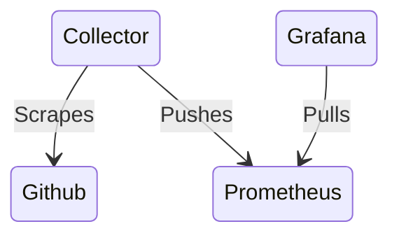

# o11y-demo

This is a self contained demo of the [Liatrio OpenTelemetry Collector](https://github.com/liatrio/liatrio-otel-collector) and [Grafana](https://grafana.com/) using [Prometheus](https://prometheus.io/) as the data source. The intent of this demo is to show how to use the Liatrio OpenTelemetry Collector to scrape data from GitHub and expose it to Grafana for visualization. This demo is not intended to be used in production.

There is also a bonus section that shows a local development workflow for making changes to the Liatrio OpenTelemetry Collector utilizing Grafana to visualize and Promethues as the data store and a locally built collector image.

- [o11y-demo](#o11y-demo)
  - [Architecture](#architecture)
  - [Pre-requisites](#pre-requisites)
  - [Getting Started](#getting-started)
  - [Bonus Section: Development Workflow](#bonus-section-development-workflow)
  - [TODO](#todo)

## Architecture 

## Pre-requisites

- The Liatrio OpenTelemetry Collector images are hosted on ghcr.io see [here](https://docs.github.com/en/packages/working-with-a-github-packages-registry/working-with-the-container-registry#authenticating-with-a-personal-access-token-classic) for instructions on how to login
- The runtime Collector requires a GitHub Personal Access Token with the following configurations:
  - Can be fine-grained or classic
  - Contents read
  - Metadata read

## Getting Started

1. Clone this repo
2. Create a `.env` file in the root of the repo, make a copy of the [example](.env.example)
3. Run `docker compose up`
4. Open grafana by navigating to [http://localhost:3000](http://localhost:3000)
5. To view the demo dashboard in Grafana go to dashboards > o11y > demo

| Service | Link |
| --- | --- |
| Grafana | http://localhost:3000 |
| Prometheus | http://localhost:9090 |
| Collector gRPC Receiver | http://localhost:4317 |
| Collector HTTP Receiver | http://localhost:4318 |
| Collector Prometheus Metrics | http://localhost:9464/metrics |
| Collector Health Check | http://localhost:8888/metrics |

## Bonus Section: Development Workflow

When you want to test pre-release functionality from the liatrio collector or test newly developed functionality you can use the following workflow to test your changes locally in a full stack environment.

1. Clone the [liatrio-otel-collector](https://github.com/liatrio/liatrio-otel-collector) repo
2. Run `make dockerbuild` in the root of the liatrio-otel-coollector repo
3. Follow [Getting Started](#getting-started) section but uncomment `OTEL_COLLECTOR_IMAGE` variable in the `.env` file
4. Run `docker compose up` in the root of this repo
5. For a more detailed developer workflow read the docs in the [liatrio-otel-collector](https://github.com/liatrio/liatrio-otel-collector) repo

## TODO

- [x] consider publishing collector image with arch amd64 as latest tag
  - Decision was made to just use amd64 arch in the compose file for now
- [ ] add health check endpoint back in and update documentation
- [ ] dashboard template variables
- [ ] expand dashboard to include some more advanced expression to show off what you can do with granular data 
- [ ] fix panic in collector
