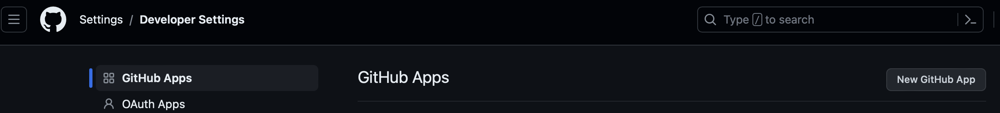
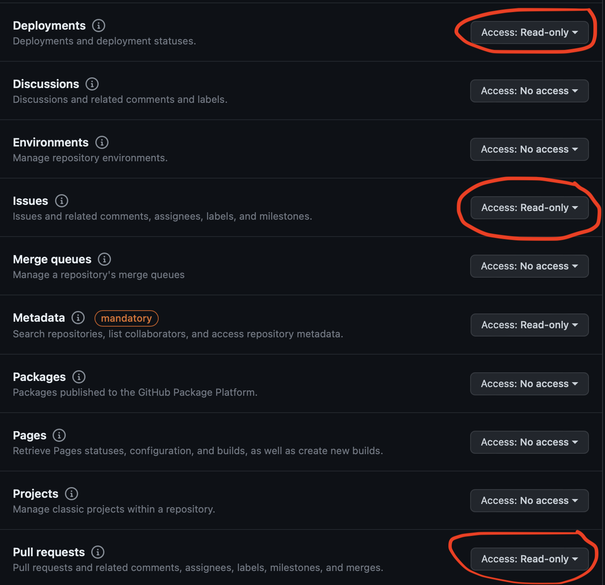
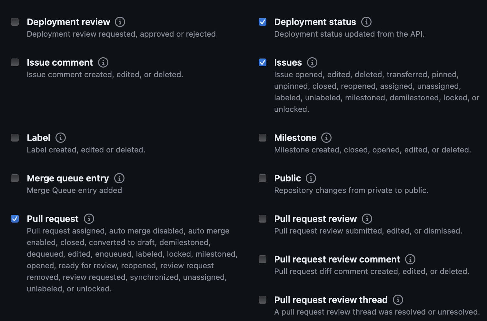

# o11y-demo

This is a self contained demo of the [Liatrio OpenTelemetry Collector](https://github.com/liatrio/liatrio-otel-collector) and [Grafana](https://grafana.com/) using [Prometheus](https://prometheus.io/) as the data source. The intent of this demo is to show how to use the Liatrio OpenTelemetry Collector to scrape data from GitHub and expose it to Grafana for visualization. This demo is not intended to be used in production.

There is also a bonus section that shows a local development workflow for making changes to the Liatrio OpenTelemetry Collector utilizing Grafana to visualize and Promethues as the data store and a locally built collector image.

- [o11y-demo](#o11y-demo)
  - [Architecture](#architecture)
  - [Pre-requisites](#pre-requisites)
  - [Getting Started](#getting-started)
  - [Bonus Section: Development Workflow](#bonus-section-development-workflow)
  - [Bonus Section: DORA Metrics with GitHub Event Logs](#bonus-section-dora-metrics-with-github-event-logs)
      - [Requirements](#requirements)
  - [TODO](#todo)

## Architecture

## Pre-requisites

- The Liatrio OpenTelemetry Collector images are hosted on ghcr.io see [here](https://docs.github.com/en/packages/working-with-a-github-packages-registry/working-with-the-container-registry#authenticating-with-a-personal-access-token-classic) for instructions on how to login
- The runtime Collector requires a GitHub Personal Access Token with the following configurations (Can be fine-grained or classic):
  - repo:All
  - read:packages
  - read:org
  - read:user
  - read:enterprise
  - read:project

?> This is a classic token configuration, fine grained might be easier

## Getting Started

1. Clone this repo and navigate to the root directory
2. Create a `.collector.env` file in the root of the repo, make a copy of the [example](.collector.env.example)
3. Make sure organization is set to liatrio, unless you want to specify another
4. Run `docker compose up`
5. Open grafana by navigating to [http://localhost:3000](http://localhost:3000)
6. To view the demo dashboard in Grafana go to dashboards > o11y > demo

?> You will need to wait a moment for Grafana to recieve data from Prometheus, the page will look like this until enough data has been recieved:

Once the data has been recieved it should look like this:

| Service | Link |
| --- | --- |
| Grafana | [http://localhost:3000](http://localhost:3000) |
| Prometheus | [http://localhost:9090](http://localhost:9090) |
| Collector gRPC Receiver | [http://localhost:4317](http://localhost:4317) |
| Collector HTTP Receiver | [http://localhost:4318](http://localhost:4318) |
| Collector Prometheus Metrics | [http://localhost:9464/metrics](http://localhost:9464/metrics) |
| Collector Health Check | [http://localhost:8888/metrics](http://localhost:8888/metrics) |
| Webhook Event Receiver | [http://localhost:8088/events](http://localhost:8088/events)

## Bonus Section: Development Workflow

When you want to test pre-release functionality from the liatrio collector or test newly developed functionality you can use the following workflow to test your changes locally in a full stack environment.

1. Clone the [liatrio-otel-collector](https://github.com/liatrio/liatrio-otel-collector) repo
2. Run `make dockerbuild` in the root of the liatrio-otel-coollector repo
3. Follow [Getting Started](#getting-started) section but uncomment `OTEL_COLLECTOR_IMAGE` variable in the `.env` file
4. Run `docker compose up` in the root of this repo
5. For a more detailed developer workflow read the docs in the [liatrio-otel-collector](https://github.com/liatrio/liatrio-otel-collector) repo

## Bonus Section: DORA Metrics with GitHub Event Logs

1. Create a GitHub App with permissions for `Issues` `Deployments` and `Pull requests` then have it subscribed to `Issues` `Deployment Status` and `Pull request` events while leaving webhooks disabled for now. This can be done by navigating to Settings->Developer Settings->GitHub Apps.

GitHub App Permissions             |  Github App Event Subscriptions
:-------------------------:|:-------------------------:
  |   

3. Using [Ngrok](https://ngrok.com) or another tool to forward traffic from your GitHub App to your local machine, set up forwarding to `http://localhost:8088/` which is going to be the endpoint for our webhook receiver should it be running locally.
4. This is going to give you a web address which we will be using as our webhook url in our GitHub App.  Be sure to add `/events` to that address as that is the path that the webhook event receiver will be expecting these event logs at by default.
5. Uncomment the relevant code in the `collector-config.yaml` and `docker-compose` file in order to setup the tools required for this.
6. Clone the [liatrio-otel-collector](https://github.com/liatrio/liatrio-otel-collector) repo
8. Run `make dockerbuild` in the root of the liatrio-otel-coollector repo
9. Run `docker compose up` in the root of this repo
10. Now you should be all set to start ingesting GitHub event logs. 

#### Requirements
1. Use GitHub Issues to track outages/interuptions in service caused by a recent deployment
2. There should only be one issue open at a time with a label called `incident` for all problems caused by the latest deployment
3. For GitHub to keep track of your deployments, you must be using GitHub Environments inside the workflow that runs the deployment
4. The workflow also has to be using tooling that deploys your code from GitHub to an external platform or GitHub itself such as [Terraform](https://www.terraform.io)

## TODO

- [x] consider publishing collector image with arch amd64 as latest tag
  - Decision was made to just use amd64 arch in the compose file for now
- [ ] add health check endpoint back in and update documentation
- [x] dashboard template variables
- [ ] expand dashboard to include some more advanced expression to show off what you can do with granular data
